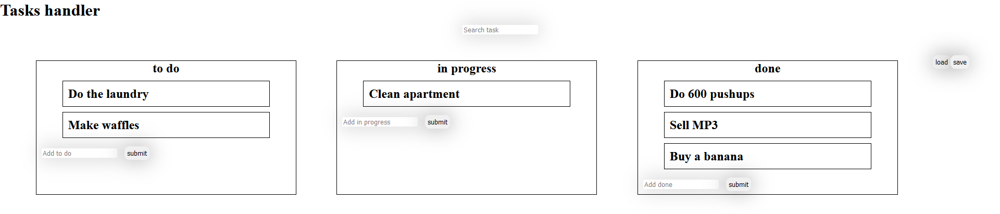

# Cyber4s 3rd Pre-Course Final Project

## What we will be building

Welcome to your pre-course final project. You are going to build a task-management application.



## Instructions

1. Fork this repo into your account.
2. Clone the forked repo to your computer.
3. Run the [setup](#setup) script.
4. Create a new git branch for your work.
5. Complete the project [requirements](#requirements).
6. Push your work to GitHub.
7. [Submit](#submission) your work.

## Setup

Execute `npm run final <your name>` (replace `<your name>` with your name). This command will install all the needed dependencies, and generate an [api-data.txt](#api-integration) file.

## Requirements

### Page Structure

There should be 3 `section` elements. One for to-do tasks, one for in-progress tasks, and one for done tasks.

Each `section` should contain:

- [ ] a `ul` element with the appropriate class - `to-do-tasks`/`in-progress-tasks`/`done-tasks`
- [ ] an `input` element with an appropriate id - `add-to-do-task`/`add-in-progress-task`/`add-done-task`
- [ ] a `button` element with an appropriate id - `submit-add-to-do`/`submit-add-in-progress`/`submit-add-done`
- [ ] Each `ul` should contain task elements, which are `li` elements with the `task` class.

In addition the page should contain:

- [ ] a heading with a `page-title` id
- [ ] a global input with the `search` id

### Interaction

- [ ] When the user clicks on one of the add-task buttons, a new task will be added to the respective list. The task content will be taken from the respective input field.
- [ ] Trying to submit empty tasks should cause an alert.
- [ ] Double clicking a task element will enable the user to edit its text. When the task element loses focus (`blur` event) the change will be saved.
- [ ] Hovering over a task element and pressing `alt + 1-3` will move the task to the appropriate list (`1`: todo, `2`: in-progress, `3`: done).
- [ ] The search input should filter tasks case-**in**sensitively, so that only tasks that match the search string are displayed. The filter will be reapplied every time the user changes the content of the search input (on **every keystroke**).

### Storage

- [ ] The data of all the tasks should be saved to `localStorage` following any changes made to the data. The data should be saved under a storage key named `tasks`. It should be saved in the following format (use the data saved in the local storage to keep the data on the page after refresh):

```json
{
  "todo": [],
  "in-progress": [],
  "done": []
}
```

- [ ] Even if there are no tasks, there should still be a `tasks` key in the `localStorage`, in the above format (the arrays will just be empty).

## Bonuses

- [ ] Implement drag-and-drop sorting of tasks.
- [ ] Add API integration:

  - [ ] Add save and load buttons that sync the current tasks to the API (see details in the [api-data.txt](#api-integration) file).
  - [ ] Remove the `.skip` from the two last tests in `main.test.js`.
  - [ ] While waiting for a response from the API display a loader with the class `loader`.
  - [ ] If an error occurs show an alert.
  - [ ] If the data loaded from the API is different from the local data, replace the local data with the API data. Make sure you update both the `localStorage` and the DOM.

- [ ] Add any additional cool features you can think of...

## README

You are expected to change the README of your project to showcase your application. Make it readable and explain what your app does. Put a screenshot and a link to GitHub pages.

## Template

You are provided with a template to write your code in, inside the `solution` folder. You should write your code inside `index.html`, `index.js`, `style.css`. You may create additional files for your convenience, but do not change the names of the existing ones.

## API Integration

Once you complete the [initial setup](#setup) you will see an `api-data.txt` file that was created in the project folder. This file will contain the URLs which you can access the API with, using a unique bin ID that was generated for you.

The API is a simple remote storage that gives you a "bin" where you can store data. It allows you to save a chunk of data, or load it.

## Testing

We have added some automated tests for you to use. They will help you make sure your code covers the requirements.

To run the tests, execute `npm run test`.

## Grading

Your work will be graded based on the following considerations:

- The number of tests you pass
- Readable and ordered code
  - Spacing & indentation
  - Indicative vairable/function names
  - Comments (where necessary)
- Proper use of Git
  - Small, standalone commits
  - Descriptive commit messages
  - Working in branches and creating a proper PR
- Convenient visual design (make your app b-e-a-utiful)
- Extra features you might have added

## Submission

1. On GitHub, open a pull request from your branch to the main branch.
2. **Do not merge the pull request!**
3. Add the user `Cyber4sPopo` as collaborator to your repo.
4. Deploy your application to GitHub pages.
5. Submit in Google Classroom:
   - a link to the pull request
   - a link to your site on GitHub pages
   - a 5 minutes min selfie video, where you talk about yourself in a few words (age, location, military background, technological background). Think about this video as a part of your interview.
   - another 2-5 minute video where you talk about your submission solution, showing how your app works and any special features you added.
